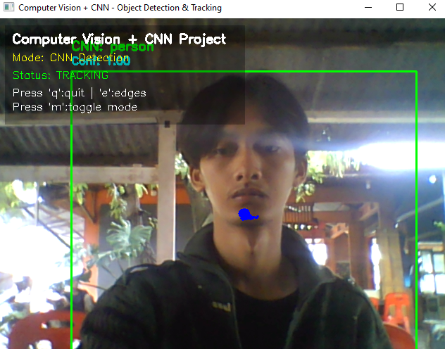
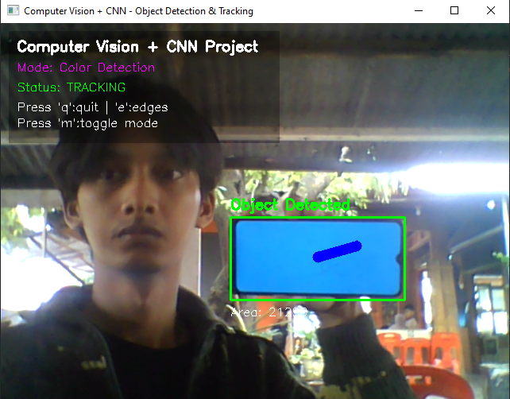
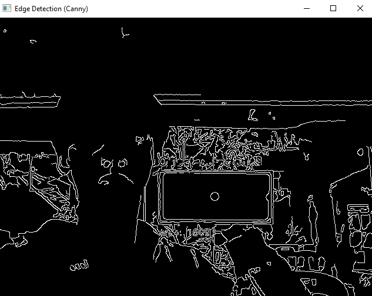

# 🎯 Computer Vision Project: Object Detection & Tracking with CNN + AR

Sistem deteksi dan pelacakan objek real-time yang mengintegrasikan **traditional computer vision** dan **deep learning (CNN)** dengan elemen Augmented Reality.

---

## ✨ Features

### 🔍 Dual Detection System

- **Color Detection Mode**: Traditional CV dengan HSV color segmentation
- **CNN Detection Mode**: Deep learning dengan MobileNet-SSD
- Switch antar mode secara real-time (tekan 'm')

### 🤖 CNN-Powered Detection

- ✅ Pretrained MobileNet-SSD model (trained on PASCAL VOC)
- ✅ Detect 20+ object classes (person, car, dog, bottle, dll)
- ✅ Confidence scoring untuk setiap detection
- ✅ Real-time inference tanpa GPU

### 🎨 Computer Vision Techniques

- ✅ Image filtering (Gaussian Blur)
- ✅ Edge detection (Canny)
- ✅ Color segmentation (HSV)
- ✅ Morphological operations
- ✅ Boundary detection
- ✅ Feature extraction
- ✅ Object tracking dengan trajectory visualization

### 🌟 Augmented Reality

- ✅ Bounding boxes dengan adaptive colors
- ✅ Object labels dan confidence scores
- ✅ Tracking trail dengan gradient effect
- ✅ Real-time information overlay

### ⚡ Interactive Controls

- `q` - Quit program
- `e` - Toggle edge detection view
- `m` - Switch detection mode (Color ↔ CNN)

---

## 🎥 Demo

### CNN Detection Mode



> Multi-class object detection dengan confidence scores

### Color Detection Mode



> Deteksi objek biru dengan tracking trail

### Edge Detection



> Canny edge detection overlay

---

## 🛠️ Tech Stack

| Technology        | Purpose                                     |
| ----------------- | ------------------------------------------- |
| **Python 3.7+**   | Programming language                        |
| **OpenCV 4.8+**   | Computer vision operations & DNN module     |
| **NumPy**         | Mathematical operations                     |
| **MobileNet-SSD** | Pretrained CNN model untuk object detection |

---

## 📦 Installation

### 1. Clone Repository

```bash
git clone https://github.com/ReyanAndrea/SistemDeteksiDanPelacakan.git
cd SistemDeteksiDanPelacakan
```

### 2. Install Dependencies

```bash
pip install -r requirements.txt
```

**Dependencies:**

- `opencv-python==4.8.1.78`
- `opencv-contrib-python==4.8.1.78`
- `numpy==1.24.3`

### 3. Verify Installation

Jalankan program:

```bash
python main.py
```

Expected output:

```
========================================
SISTEM COMPUTER VISION + CNN
========================================
CNN Model: LOADED ✓
Detection Mode: COLOR
...
```

---

## 🚀 Usage

### Quick Start

```bash
python main.py
```

### Detection Modes

#### 🔵 Color Detection Mode (Default)

1. Siapkan objek **berwarna biru** (kertas, spidol, bola, dll)
2. Arahkan ke webcam
3. Objek akan terdetect dengan:
   - Bounding box hijau
   - Area information
   - Tracking trail biru

**Use Case**: Controlled environment, color-coded objects, maximum speed

#### 🧠 CNN Detection Mode

1. Tekan **'m'** untuk switch ke CNN mode
2. Arahkan objek apapun yang termasuk dalam 20 classes:
   - 👤 **Person** (diri sendiri)
   - 🚗 **Vehicles** (car, bicycle, motorbike, bus)
   - 🐕 **Animals** (cat, dog, bird, horse, cow, sheep)
   - 🪑 **Indoor Objects** (chair, sofa, table, bottle, potted plant, tv)
   - ✈️ **Others** (aeroplane, boat, train)
3. Hasil detection menampilkan:
   - Object class name
   - Confidence score (0.0 - 1.0)
   - Bounding box
   - Tracking trail

**Use Case**: Versatile object recognition, high accuracy, real-world scenarios

### Keyboard Controls

| Key | Function                     |
| --- | ---------------------------- |
| `q` | Quit program                 |
| `e` | Toggle edge detection window |
| `m` | Switch detection mode        |

---

## 🔄 Detection Modes

### Comparison: Color vs CNN

| Aspect          | Color Detection        | CNN Detection                  |
| --------------- | ---------------------- | ------------------------------ |
| **Speed**       | ⚡⚡⚡ Very Fast       | ⚡⚡ Fast                      |
| **Accuracy**    | ✅ Good (single color) | ✅✅✅ Excellent (multi-class) |
| **Versatility** | ⚠️ Limited to color    | ✅ 20+ object types            |
| **Setup**       | ✅ No model needed     | ⚠️ Need model files (~23MB)    |
| **Lighting**    | ⚠️ Sensitive           | ✅ Robust                      |
| **CPU Usage**   | 💚 Low                 | 💛 Medium                      |

### When to Use Each Mode?

**Use Color Detection when:**

- You have color-coded objects
- Maximum speed is priority
- Controlled lighting environment
- Simple detection task

**Use CNN Detection when:**

- Need to recognize diverse objects
- Accuracy is more important than speed
- Real-world varied conditions
- Want confidence scores

---

## 📂 Project Structure

````
project/
│
├── main.py                          # Main program
├── requirements.txt                 # Python dependencies
├── README.md
│
├── deploy.prototxt                  # CNN architecture (download)
└── mobilenet_iter_73000.caffemodel  # CNN weights (download)

---

## 🎨 Customization

### Change Target Color (Color Detection)

Edit `main.py`:

```python
def detect_object_by_color(self, frame):
    hsv = cv2.cvtColor(frame, cv2.COLOR_BGR2HSV)

    # Example: Detect RED instead of blue
    lower_red = np.array([0, 50, 50])
    upper_red = np.array([10, 255, 255])

    mask = cv2.inRange(hsv, lower_red, upper_red)
    # ...
````

#### HSV Color Ranges

| Color     | Hue Range       |
| --------- | --------------- |
| 🔴 Red    | 0-10 or 170-180 |
| 🟠 Orange | 10-20           |
| 🟡 Yellow | 20-40           |
| 🟢 Green  | 40-80           |
| 🔵 Blue   | 100-130         |
| 🟣 Purple | 130-170         |

### Adjust CNN Confidence Threshold

```python
def detect_with_cnn(self, frame):
    # ...
    if confidence > 0.5:  # Change 0.5 to:
                          # 0.3 = more detections (less strict)
                          # 0.7 = fewer detections (more strict)
        # ...
```

### Change Tracking Trail Length

```python
def __init__(self):
    # Change maxlen to adjust trail length
    self.tracking_points = deque(maxlen=64)  # 64 points default
                                             # 32 = shorter trail
                                             # 128 = longer trail
```

---

## 🧪 Computer Vision Techniques

Project ini mengimplementasikan berbagai teknik CV:

### 1. **Convolutional Neural Networks (CNN)**

- MobileNet-SSD architecture
- Transfer learning dari PASCAL VOC
- Single-shot detection
- Multi-scale feature maps

### 2. **Image Preprocessing**

- Gaussian filtering untuk noise reduction
- Color space conversion (BGR → HSV)
- Image resizing untuk CNN input

### 3. **Edge Detection**

- Canny edge detector
- Multi-stage algorithm
- Hysteresis thresholding

### 4. **Color Segmentation**

- HSV color space thresholding
- Binary masking
- Illumination robustness

### 5. **Morphological Operations**

- Erosion untuk noise removal
- Dilation untuk gap filling
- Opening operation (erosion + dilation)

### 6. **Contour Analysis**

- Boundary detection
- Contour approximation
- Largest contour selection

### 7. **Feature Extraction**

- Moment calculation
- Centroid computation
- Area dan perimeter measurement

### 8. **Object Tracking**

- Centroid-based tracking
- Trajectory history (deque)
- Motion trail visualization

### 9. **Augmented Reality**

- Real-time overlay
- Dynamic bounding boxes
- Information display
- Confidence visualization

---

## 👤 Author

**Reyan Andrea**

- 🎓 NIM: 2208107010014
- 📧 Email: reyan_andr@mhs.usk.ac.id

---

## 📚 References

1. Howard, A. G., et al. (2017). MobileNets: Efficient CNNs for Mobile Vision
2. Liu, W., et al. (2016). SSD: Single Shot MultiBox Detector
3. Everingham, M., et al. (2010). The PASCAL VOC Challenge
4. OpenCV Documentation - https://docs.opencv.org/

---
